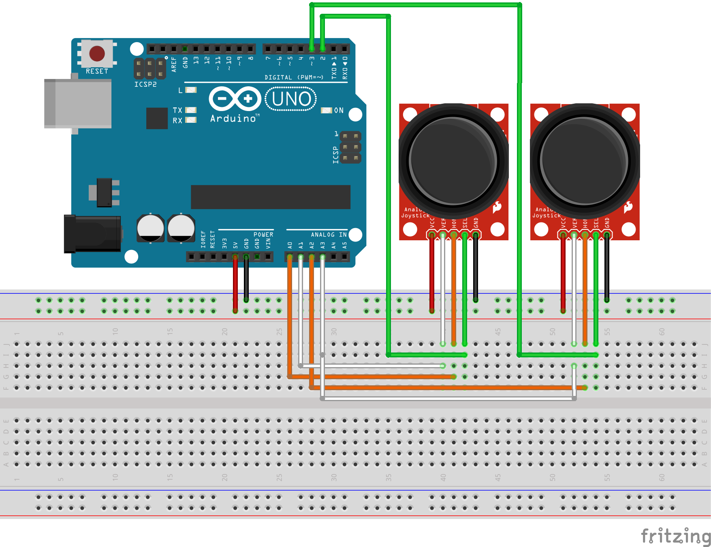

# Arduino game controller for ROS

## Introduction

This project aims to create an open source game controller based on an Arduino which can be interfaced with the [Robot Operating System (ROS)](https://www.ros.org/) through a USB serial connection to a computer running ROS. At its current state, the controller consists of two [PS2 joysticks](https://www.banggood.com/fr/Keyes-Brick-PS2-Dual-Axis-Key-Rocker-Sensor-Module-Compatible-with-Micro-Bit-p-1717224.html) connected to an [Arduino UNO](https://store.arduino.cc/arduino-uno-rev3) board.

## Requirements

### ROS library for Arduino

You need to install this library in the Arduino IDE you will be using to upload the code to your Arduino board. The library can be easily installed direcly from the Arduino IDE by searching for "rosserial" under Sketch -> Include Library -> Manage Libraries...

#### Issues

* Make sure you have "Arduino as ISP" selected unter Tools -> Programmer.
* You might have to upload the code to the board using ctrl + shift + u after selecting the programmer.
* If you run into trouble try looking at the upload output, which can be turned on from File -> Preferences by ticking the box under "Show verbose output during: upload".

### ROS

We recommend installing ROS on Ubuntu. To install it, select a distribution compatible with your Ubuntu version [here](http://wiki.ros.org/ROS/Installation) and follow its installation tutorials. The code under this project has been tested to work with ROS Noetic.

### rosserial_arduino

The corresponding ROS packages can be installed using the following two commands by substituting \<distro\> with the name of your ROS distribution.
```
sudo apt-get install ros-<distro>-rosserial-arduino
sudo apt-get install ros-<distro>-rosserial
```

## Components List

As the system is still under development, its current version is breadboard-based. Future modifications will seek to have all the components put under an enclosure similar to that of many game controllers.

The components are as follows:

* [Arduino UNO](https://store.arduino.cc/arduino-uno-rev3) board, or any of its equivalents.
* 2 [Keyes Brick PS2 Modules](https://www.banggood.com/fr/Keyes-Brick-PS2-Dual-Axis-Key-Rocker-Sensor-Module-Compatible-with-Micro-Bit-p-1717224.html).
* Breadboard.
* Jumper wires.

## Wiring

Refer to the following wiring diagram, note that the order of the wires will differ according to the specific version of PS2 joystick you acquire. VCC and GND correspond to + and - ports respectively, B corresponds to SEL, X to HOR and Y to VER.



## Running

* Upload the .ino script under the src directory to the Arduino UNO from the Arduino IDE (see [this section](####issues) if you encounter any errors)
* Connect your Arduino UNO to your computer directly through USB
* Figure out which device the Arduino is associated with by running `ls /dev/tty*`. You should see it listed under the prefixes /dev/ttyUSB or /dev/ttyACM. If there's more than one device, try running the same command with the Arduino both connected and disconnected to the computer and comparing the difference in the devices that show up.
* Run `roscore` on a terminal
* Run the following command, replacing the last parameter with the device associated with your Arduino:
```
rosrun rosserial_python serial_node.py /dev/ttyACM0
```